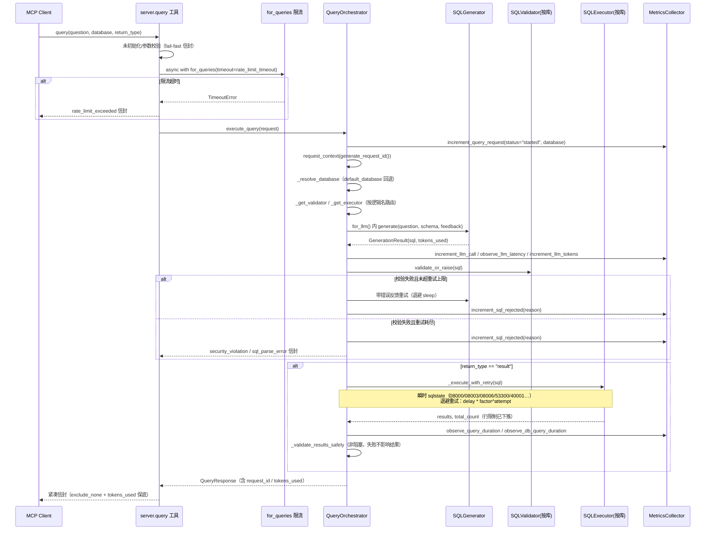

# pg-mcp 功能增强方案：多数据库安全控制 + 弹性可观测性接线 + 模型清理

## 1. 文档信息

| 项目 | 内容 |
| --- | --- |
| 文档编号 | specs/w6/0001-enhancement-design.md |
| 版本 | 1.0 |
| 日期 | 2026-10-04 |
| 状态 | 已评审通过 |
| 评审方式 | 6 个并行探索代理 + 综合差距分析 + Plan 代理设计 + 人工逐行验证 |
| 关联文档 | `docs/DEVELOPMENT.md`（开发指引）、`specs/w6/0002-implementation-report.md`（增强报告） |
| 变更范围 | 配置层 / 服务层 / 模型层 / 可观测性层 / 测试体系 / 入口与构建 |

---

## 2. 背景与问题分析

pg-mcp 是基于 MCP SDK FastMCP 的 PostgreSQL 自然语言查询服务器（Python 3.14 / asyncpg / sqlglot / pydantic-settings / prometheus-client）。本期增强源于三项用户抱怨，经代码级验证全部属实，并在探索过程中发现额外缺陷（`.env` 嵌套配置节加载失效、EXPLAIN ANALYZE 绕过校验、根目录 `main.py` 为无关桩文件等）。问题归并为三大问题域。

> **证据基线**：本章所有 `file:line` 引用均以增强前的基线代码为准（`main` @ `38843c3`，即本方案评审时的仓库状态）。实现阶段（Phase 3 起）落地后行号会随之漂移，属预期；评审问题时请对照基线 commit。

### 2.1 问题域 A：多数据库与安全控制未启用（Critical）

**A1. 多库路由断裂。**
配置层仅有单一 `DatabaseConfig`（`src/pg_mcp/config/settings.py:198`），lifespan 只创建 1 个连接池（`src/pg_mcp/server.py:99-102`）；`db/pool.py:50` 的 `create_pools` 在全仓库范围内零调用者（仅定义与导出）。组装 orchestrator 时只注入主库执行器（`src/pg_mcp/server.py:197`），而 `src/pg_mcp/services/orchestrator.py:198` 恒定调用 `self.sql_executor.execute(generated_sql)` —— `request.database` 在 Step 1 解析后（`orchestrator.py:138`）从未传递到执行步。当前单库场景下表现为"碰巧正确"；一旦多 pool 存在即发生错误数据库执行。

**A2. 安全策略无法启用。**
`SQLValidator` 已完整实现 `blocked_tables` / `blocked_columns` / `allow_explain` 三项能力（构造器 `src/pg_mcp/services/sql_validator.py:77-100`；表级检查 236-255、列级检查 257-283、EXPLAIN 开关 152-158），但 `src/pg_mcp/server.py:153-158` 组装时硬编码 `blocked_tables=None, blocked_columns=None, allow_explain=False`，且 `SecurityConfig`（`settings.py:73-108`）没有对应字段 —— 用户无论怎么配置，按库黑名单永远为空。

**A3. EXPLAIN ANALYZE 绕过校验。**
`allow_explain=True` 时 EXPLAIN 分支直接 `return None` 不校验内层语句（`sql_validator.py:152-168`，旁路点在 163 行）。注释声称 "EXPLAIN is read-only and safe"，但 `EXPLAIN ANALYZE` 会**实际执行**内层语句 → 表黑名单、列黑名单、危险函数黑名单全部绕过，等于一条 `EXPLAIN ANALYZE DELETE FROM users` 即可造成数据破坏。

**A4. `.env` 对嵌套配置节失效。**
仅顶层 `Settings` 声明了 `env_file=".env"`（`settings.py:186-191`），7 个嵌套 BaseSettings 节（`DatabaseConfig` / `OpenAIConfig` / `SecurityConfig` / `ValidationConfig` / `CacheConfig` / `ResilienceConfig` / `ObservabilityConfig`，`settings.py:17/49/76/114/139/151/171`）均未声明且不继承 → `.env` 中的 `DATABASE_*` 等变量被静默忽略，只有 OS 环境变量生效。叠加 `.env.example:79` 的 `OPENAI_MAX_TOKENS=32000` 违反 `settings.py:53` 的 `le=4096` 约束 —— 一旦修好加载，按 example 配置启动即崩。

### 2.2 问题域 B：弹性与可观测性未接线（High）

**B1. 限流器零调用。**
`MultiRateLimiter` 被硬编码创建（`server.py:187-190`，`query_limit=10, llm_limit=5` 写死），但 `query` 工具（`server.py:252-373`）从不 acquire —— `_rate_limiter` 全部引用仅出现在全局声明与创建处。另需如实说明：该实现是基于 `asyncio.Semaphore` 的**并发数**限制器（`resilience/rate_limiter.py:14-43`），并非 QPS 限流器。

**B2. 重试无退避、瞬时错误不重试。**
`_generate_sql_with_retry` 的重试循环（`orchestrator.py:377-478`）零 `sleep`，仅对校验失败重试；`orchestrator.py:458-460` 将 `LLMError`（含 `LLMTimeoutError` / `LLMUnavailableError`）直接 re-raise。`ResilienceConfig.retry_delay` / `backoff_factor`（`settings.py:154-159`）是零消费者的死配置。

**B3. 指标全零。**
`MetricsCollector` 已注册完整指标（`observability/metrics.py:46-103`），lifespan 也启动了 HTTP server，但请求链路（services/ 目录）零调用 —— `/metrics` 端点永远输出全零。README 所列 6 个指标名（`README.md:470-475`）中 5 个与代码实际注册名不符（实际为 `pg_mcp_query_requests_total` / `pg_mcp_llm_calls_total` / `pg_mcp_sql_rejected_total` 等）。`reset_all_metrics`（`metrics.py:187-194`）直接重新 `_initialize_metrics()`，在默认注册表上重注册会抛 `ValueError`。

**B4. 追踪设施闲置 + 并发缺陷。**
`observability/tracing.py` 的 `request_context` / `generate_request_id` 零业务调用，orchestrator 手搓 `uuid.uuid4()`（`orchestrator.py:9-10, 129-130`）；`tracing.py:154-166` 的 `trace_async` 通过全局交换 `logging.setLogRecordFactory` 注入 request_id，并发请求间会互相污染（全局状态竞争）。

**B5. 死全局与死配置。**
server 级 `_circuit_breaker`（`server.py:37, 181-184`）创建后无人使用（orchestrator 在 `orchestrator.py:99-102` 自建实例）；DB 执行路径无熔断保护。

### 2.3 问题域 C：模型缺陷与测试不足（High/Medium）

**C1. 响应模型缺陷。**
`QueryResponse` 定义了**两个** `to_dict`（`src/pg_mcp/models/query.py:160` 与 `query.py:214`），Python 类体内后定义覆盖前者，前者成为死代码且语义分裂（前者 `exclude_none=False` + tokens 保底，后者 `exclude_none=True`）。存在两个同名 `ErrorDetail` 类（`query.py:139-144` 与 `models/errors.py:39-71`，前者 pydantic、后者普通类）。`tokens_used` 永远为 0：`sql_generator.generate` 仅返回 SQL 字符串、未读取 `response.usage`（`services/sql_generator.py:99-152`），`orchestrator.py:375` 的 `tokens_used` 恒为 `None`，最终由 `query.py:170-171` 兜底为 0。成功路径的 `ValidationResult` 是硬编码伪造（`orchestrator.py:447-454`）。

**C2. 行限制先全量 fetch 再切片。**
`sql_executor.py:104-107` 全量 `fetch` 后在 117-122 行内存切片 —— 大结果集（远超 `max_rows`）会先完整载入内存。

**C3. 测试不可验证。**
`tests/` 下无 `tests/security/` 目录、无 `test_server_tool.py`、无 `test_databases_config.py`；server.py / observability / pool / introspection / result_validator 零直接测试。`pyproject.toml:82` 的 `addopts = "-v --tb=short"` 不含 `--cov`，而 `fail_under = 80` 配置在 `[tool.coverage.report]`（`pyproject.toml:93`）—— 覆盖率门禁从不触发。integration / e2e 测试无 skip 守卫（无数据库时直接红）。

**C4. 入口与依赖漂移。**
根目录 `main.py` 是 "add two numbers" 无关桩（`main.py:1-11`，`from fastmcp import FastMCP`），但 Dockerfile 以它为入口（`Dockerfile:96`）、健康检查引用未安装的 `psutil`（`Dockerfile:91-92`）。`pyproject.toml:14` 的 `fastmcp` 依赖唯一消费者就是这个桩；真正的服务端使用 `mcp.server.fastmcp`（`server.py:13`）。

**C5. 死配置字段。**
`allow_write_operations`（`settings.py:78`）、`max_question_length`（116）、`min_confidence_score`（119）、`is_production` / `is_development`（206-214）、`CacheConfig.max_size`（144，`schema_cache.py:44` 的 `_cache` 是普通 dict，无 LRU 逐出）均为零消费者。

---

## 3. 目标与非目标

### 3.1 目标

1. **多数据库路由**：通过 `DATABASES_FILE`（JSON）声明多库（连接 + 安全规则），lifespan 按注册表循环创建 per-db pool / validator / executor；orchestrator 按逻辑库名路由；无 JSON 时回退单库 `DATABASE_*` 环境变量（向后兼容）。
2. **按库安全控制**：每库独立 `blocked_tables` / `blocked_columns` / `allow_explain`，`None` 时继承 `SECURITY_*` 全局默认；修复 EXPLAIN 内层语句校验旁路。
3. **弹性接线**：限流器（`for_queries` / `for_llm`）真正接入请求链路；瞬时错误（LLM 超时/不可用、瞬时 PG sqlstate）指数退避重试。
4. **可观测性接线**：请求全链路指标埋点非零；`request_id` 贯穿日志并进入响应信封；修复 tracing 并发缺陷与 `reset_all_metrics` 重注册崩溃。
5. **模型与配置清理**：统一 `to_dict` 语义、统一 `ErrorDetail`、`tokens_used` 真实化、行限制下推、死配置接线或删除、入口与依赖对齐。
6. **测试可信**：补齐 unit / security / integration / e2e 分层，覆盖率门禁 80% 真正生效。

### 3.2 非目标

| 非目标 | 说明 |
| --- | --- |
| lazy schema load | 非主库 schema 仍随 lifespan 启动加载；多库启动成本通过 fixture 场景 `pool min=2` 控制。记入 future work |
| OpenTelemetry | 本期只接线既有 prometheus-client 模块，不引入 OTel SDK / span 导出 |
| QPS 限流 | 保留信号量并发限制语义（文档如实说明），不实现令牌桶/滑动窗口 QPS |
| DB 执行熔断 | 熔断仍仅覆盖 LLM 调用路径；DB 侧以退避重试 + 只读事务为韧性手段 |
| 写操作支持 | 永久只读（SELECT-only），`allow_write_operations` 直接删除而非接线 |
| schema 自动刷新 | 保持注释禁用状态不变 |
| 前向兼容旧信封字段 | 不保留被删除字段的兼容垫片（见第 6 节兼容性矩阵） |

---

## 4. 总体架构设计

### 4.1 目标架构

```text
┌─────────────────────────────────────────────────────────────────────────┐
│                          配置解析层（启动期）                            │
│                                                                         │
│  .env / OS env ──┐                                                      │
│                  ├─► Settings（顶层 env_file 已有，7 个嵌套节补齐）      │
│  DATABASES_FILE ─┘        │                                             │
│      │                    │                                             │
│      ▼                    ▼                                             │
│  databases.json ─► load_databases_file() ─► DatabaseEntry 列表          │
│                        │                                                │
│                        └─► resolve_database_entries(settings)           │
│                            JSON 优先；无 JSON 则由 DATABASE_* 生成单条目 │
└────────────────────────────┬────────────────────────────────────────────┘
                             ▼
┌─────────────────────────────────────────────────────────────────────────┐
│                     lifespan 组装期（server.py，per-db 循环）            │
│                                                                         │
│  for entry in registry:                                                 │
│    pool      = create_pool(entry.to_database_config())   ──► pools[name]│
│    validator = SQLValidator(SECURITY_*, entry.security 覆盖)             │
│                  └─► sql_validators[name]                               │
│    executor  = SQLExecutor(pool, ...)                   ──► executors[] │
│    schema    = schema_cache.load(name, pool)                            │
│                                                                         │
│  MultiRateLimiter(query_concurrency, llm_concurrency)   ← Resilience_*  │
│  MetricsCollector（注入式，非单例导入）                                  │
└────────────────────────────┬────────────────────────────────────────────┘
                             ▼
┌─────────────────────────────────────────────────────────────────────────┐
│                     请求处理层（orchestrator 路由）                      │
│                                                                         │
│  query(question, database, return_type)                                 │
│    └─ for_queries(timeout=rate_limit_timeout)      ← 横切：并发限流     │
│        └─ execute_query(request)                                        │
│            ├─ _resolve_database ──► 逻辑库名（default_database 可回退）  │
│            ├─ _get_validator(name) / _get_executor(name)   按库路由     │
│            ├─ _generate_sql_with_retry                                   │
│            │    ├─ for_llm()                         ← 横切：LLM 限流    │
│            │    └─ 瞬时 LLM 错误退避重试             ← 横切：弹性       │
│            ├─ _execute_with_retry（瞬时 PG sqlstate 退避重试）           │
│            └─ _validate_results_safely（非阻塞）                         │
│                                                                         │
│  横切观测：request_context(generate_request_id()) 贯穿全链路；           │
│            increment_query_request / observe_query_duration /            │
│            increment_llm_* / increment_sql_rejected 全路径埋点           │
└─────────────────────────────────────────────────────────────────────────┘
```

要点：

1. **配置解析 → 组装 → 路由** 三段式。多库信息在配置层收敛为 `DatabaseEntry` 列表（唯一真相），lifespan 与 orchestrator 都只消费逻辑名 key，杜绝"主库执行器"特例。
2. **安全控制随库实例化**。每个库一个 `SQLValidator`，继承模型在构造期解析完毕，请求路径零额外判断。
3. **弹性与观测作为横切**。限流在 server 工具入口与 LLM 调用点两层包裹；重试在 orchestrator 内两个专用方法中集中实现；指标与 `request_id` 由 orchestrator 统一埋点，服务组件保持单一职责。

### 4.2 请求处理时序



---

## 5. 详细设计

### 5.1 多数据库配置

#### 5.1.1 新模块 `src/pg_mcp/config/databases.py`

| 类/函数 | 职责 |
| --- | --- |
| `DatabaseSecurityOverrides` | 每库安全覆盖项：`blocked_tables` / `blocked_columns` / `allow_explain`，默认全 `None`（= 继承全局） |
| `DatabasePoolSettings` | 每库连接池覆盖项：`min_size` / `max_size` / `timeout` / `command_timeout`，默认 `None`（= 取 `DatabaseConfig` 默认） |
| `DatabaseEntry` | 单库条目：逻辑名 + 连接字段 + `pool` + `security`；提供 `to_database_config()` 转换为 `DatabaseConfig` 以复用 `create_pool`（`db/pool.py:13`） |
| `DatabasesFile` | 文件根模型：`default_database` + `databases` 列表；校验逻辑名唯一、`default_database` 必须存在于列表 |
| `load_databases_file(path)` | 读取并校验 JSON；任何错误带文件路径上下文 fail-fast（启动期暴露，不留到请求期） |
| `resolve_database_entries(settings)` | **JSON 优先**：`settings.databases_file` 存在则加载；否则由 `settings.database` 生成单条目（env 回退，向后兼容） |

#### 5.1.2 `databases.json` Schema

```json
{
  "default_database": "blog_small",
  "databases": [
    {
      "name": "blog_small",
      "host": "localhost", "port": 5432,
      "database": "blog_small",
      "user": "postgres", "password": "postgres",
      "pool": { "min_size": 2, "max_size": 10, "timeout": 30.0, "command_timeout": 30.0 },
      "security": {
        "blocked_tables": ["audit_log"],
        "blocked_columns": ["users.email"],
        "allow_explain": false
      }
    },
    { "name": "ecommerce_medium", "database": "ecommerce_medium",
      "security": { "blocked_tables": ["payment_methods"] } },
    { "name": "saas_crm_large", "database": "saas_crm_large" }
  ]
}
```

该布局对齐 `fixtures/README.md:481-502` 的多库蓝图（三套 fixture 库 `blog_small` / `ecommerce_medium` / `saas_crm_large`）。

#### 5.1.3 字段表

| 字段 | 类型 | 必填 | 缺省语义 | 说明 |
| --- | --- | --- | --- | --- |
| `default_database` | `str` | 是 | — | `request.database` 缺省时的回退目标；必须出现在 `databases` 中 |
| `databases[].name` | `str` | 是 | — | 逻辑名，pool key / `request.database` / 指标 label；正则 `^[a-zA-Z_][a-zA-Z0-9_-]{0,62}$`，全文件唯一 |
| `databases[].database` | `str` | 否 | 取 `name` | 物理库名（逻辑名与物理库名解耦） |
| `databases[].host` / `port` / `user` / `password` | — | 否 | 同 `DatabaseConfig` 默认 | 连接字段（`settings.py:19-23`） |
| `databases[].pool.min_size` 等 | — | 否 | 同 `DatabaseConfig` | 对应 `min_pool_size` / `max_pool_size` / `pool_timeout` / `command_timeout`（`settings.py:26-33`） |
| `databases[].security.blocked_tables` | `list[str] \| null` | 否 | `null` = 继承 `SECURITY_BLOCKED_TABLES` | 表黑名单（小写匹配） |
| `databases[].security.blocked_columns` | `list[str] \| null` | 否 | `null` = 继承 `SECURITY_BLOCKED_COLUMNS` | 列黑名单，支持 `table.column` 限定形式 |
| `databases[].security.allow_explain` | `bool \| null` | 否 | `null` = 继承 `SECURITY_ALLOW_EXPLAIN`（默认 `false`） | EXPLAIN 开关 |

#### 5.1.4 合并与回退规则

| 层级 | 来源 | 规则 |
| --- | --- | --- |
| 1（最高） | `databases.json` 条目 `security.*` / `pool.*` | 非 `null` 即覆盖 |
| 2 | OS env / `.env` 的 `SECURITY_*` 全局默认 | 条目为 `null` 时继承 |
| 3 | `SecurityConfig` 字段默认值 | 全局亦未配置时 |
| 多库注册表来源 | `DATABASES_FILE` 指向 JSON | JSON 优先，忽略 `DATABASE_*` 连接组 |
| 单库回退 | 未设置 `DATABASES_FILE` 或文件不存在 | 由 `settings.database`（`DATABASE_*`）生成单条目，逻辑名 = `DatabaseConfig.name` |
| env 优先级 | OS env > `.env` > 默认值 | 修复嵌套节 `env_file` 后生效；文档化并加测试锁定 |
| 密码安全 | `databases.json` 含明文密码 | `.gitignore` 增加该文件，仓库只提交 `databases.json.example` |

#### 5.1.5 环境变量对照表（`settings.py` 变更）

| 变更 | 字段 / 节 | 说明 |
| --- | --- | --- |
| 新增 | `Settings.databases_file: str | None`（env `DATABASES_FILE`） | 指向多库 JSON；`None` = 单库回退 |
| 新增 | `SecurityConfig.blocked_tables: list[str]`（`SECURITY_BLOCKED_TABLES`，逗号分隔） | 复用 `parse_blocked_functions` 的逗号解析模式（`settings.py:102-108`） |
| 新增 | `SecurityConfig.blocked_columns: list[str]`（`SECURITY_BLOCKED_COLUMNS`） | 同上 |
| 新增 | `SecurityConfig.allow_explain: bool = False`（`SECURITY_ALLOW_EXPLAIN`） | 全局默认 |
| 新增 | `ResilienceConfig.query_concurrency` / `llm_concurrency` / `rate_limit_timeout` | 取代 `server.py:187-190` 硬编码的 `10/5` 与新引入的超时 |
| 修复 | 7 个嵌套节全部补 `env_file=".env"` | 消除 A4 静默失效 |
| 删除 | `SecurityConfig.allow_write_operations` | `extra="ignore"` 容忍旧 env 残留 |
| 删除 | `ValidationConfig.max_question_length` / `min_confidence_score` | 长度校验由 `QueryRequest.question` 的 pydantic 约束承担（`query.py:23-28`） |
| 删除 | `Settings.is_production` / `is_development` | 零消费者 |

### 5.2 按库安全控制

#### 5.2.1 继承模型

lifespan 组装期，对每个 `DatabaseEntry`：

```python
validator = SQLValidator(
    config=_settings.security,                        # blocked_functions / max_rows 等全局项
    blocked_tables=entry.security.blocked_tables      # None → 回退 settings.security.blocked_tables
        if entry.security.blocked_tables is not None
        else _settings.security.blocked_tables,
    blocked_columns=...,                              # 同上模式
    allow_explain=...,                                # 同上模式
)
sql_validators[entry.name] = validator
```

- 覆盖是**整体替换**而非合并（条目声明了 `blocked_tables` 就以条目为准），语义简单可预测。
- `blocked_functions` 不做每库覆盖：内置危险函数清单（`sql_validator.py:55-75`）是普适底线，仅全局可扩展。

#### 5.2.2 EXPLAIN 内层语句递归校验修复（安全缺陷 A3）

现状：`sql_validator.py:152-168` 对 `exp.Command` 且 `cmd_name == "EXPLAIN"` 的语句，`allow_explain=True` 时直接放行（163 行 `return None`）。`EXPLAIN ANALYZE` 会执行内层语句，构成旁路。

修复方案（与 `allow_explain` 开关**同一阶段原子落地**，消除绕过窗口）：

1. 识别 EXPLAIN 前缀后，从原始 SQL 剥离 `EXPLAIN` 及其选项修饰（`ANALYZE` / `VERBOSE` / `COSTS` 等），提取内层语句文本；
2. 对内层语句**递归调用完整校验管线**（语句类型、危险函数、表/列黑名单、子查询安全全部适用）——`EXPLAIN DELETE FROM users` 将因内层 `DELETE` 被拒；
3. **`ANALYZE` 变体默认拒绝**：检测到 `ANALYZE` 选项时抛 `SecurityViolationError`（即使 `allow_explain=True`）；未来如需放行须显式新增独立开关，本期不提供；
4. 剥离失败或内层不可解析 → 拒绝（fail-closed，不沿用"sqlglot 解析不了就放行"的旧注释逻辑）。

纵深防御保持不变：执行层只读事务（`sql_executor.py:97`）继续兜底，EXPLAIN 修复是第一道门的补全。

### 5.3 弹性与可观测性接线

#### 5.3.1 限流接入点

| 接入点 | 包裹方式 | 超时行为 |
| --- | --- | --- |
| `server.query` 工具入口 | `async with _rate_limiter.for_queries(timeout=rate_limit_timeout)` | 返回 `rate_limit_exceeded` 信封（不抛异常） |
| `_generate_sql_with_retry` 内 LLM 调用 | `async with _rate_limiter.for_llm(timeout=...)` | 转为可重试的瞬时错误参与退避循环 |

- `_rate_limiter` 改由 `ResilienceConfig.query_concurrency` / `llm_concurrency` 构造（删除 `server.py:187-190` 硬编码）。
- 语义如实文档化：**并发数限制（信号量），非 QPS**；QPS 限流为非目标。

#### 5.3.2 瞬时错误退避重试

统一退避算法：`await asyncio.sleep(retry_delay * backoff_factor ** attempt)`（`attempt` 从 0 起）。

| 重试点 | 瞬时错误判定 | 依据 |
| --- | --- | --- |
| `_generate_sql_with_retry`（LLM） | `LLMTimeoutError` / `LLMUnavailableError`（含 OpenAI 429 / 网络抖动映射，`sql_generator.py:108-125`） | 既有 `max_retries` 上限；校验失败重试（带反馈）逻辑保留 |
| `_execute_with_retry`（新增，DB） | 瞬时 PG sqlstate：`08000`（connection_exception）/ `08003`（connection_does_not_exist）/ `08006`（connection_failure）/ `53300`（too_many_connections）/ `40001`（serialization_failure）等 | 包装 `sql_executor.execute`；非瞬时 `PostgresError` 立即上抛包装为 `DatabaseError` |

#### 5.3.3 指标埋点位置表

| 埋点 | 位置 | 时机 |
| --- | --- | --- |
| `increment_query_request(status, database)` | `execute_query` 入口 + 出口（success / error 按最终信封状态） | 每请求一次，`database` = 逻辑名 label |
| `observe_query_duration`（`metrics.py` 新增包装） | `execute_query` 整体计时 | 对应 `pg_mcp_query_duration_seconds` |
| `increment_llm_call(operation)` / `observe_llm_latency` / `increment_llm_tokens` | `sql_generator.generate` 与 `result_validator.validate` 调用点（orchestrator 内统一包裹） | tokens 来自 `GenerationResult.tokens_used` |
| `increment_sql_rejected(reason)` | 校验失败分支（含重试内与终局拒绝） | reason 归类：`blocked_table` / `blocked_column` / `blocked_function` / `ddl` 等 |
| `observe_db_query_duration` | `_execute_with_retry` 成功后 | 对应 `pg_mcp_db_query_duration_seconds` |
| `set_schema_cache_age` | `schema_cache.load` 后 | per-database label |

配套修复：`MetricsCollector.reset_all_metrics` 先 `unregister` 再重建，消除重注册 `ValueError`；orchestrator 以**构造注入**接收 `metrics`（测试用 `MagicMock(spec=MetricsCollector)`），不导入模块级单例（`metrics.py:198`），避免测试注册表碰撞。

#### 5.3.4 request_id 贯穿方案

1. `execute_query` 入口：`async with request_context(generate_request_id()) as request_id`（替换 `orchestrator.py:129-130` 手搓 `uuid4`）；
2. 全链路日志 `extra={"request_id": ...}`（既有模式保持）；
3. `QueryResponse` 新增 `request_id` 字段，随信封返回客户端（见 6.2）；
4. `tracing.py` 修复：`trace_async` / `trace_sync` 的 `logging.setLogRecordFactory` 全局交换（`tracing.py:154-166`）改为**读取 contextvar 的 `logging.Filter`**，过滤器随 logger 安装一次，并发安全。

#### 5.3.5 其他接线

- 删除 server 级死全局 `_circuit_breaker`（`server.py:37, 181-184`）；LLM 熔断以 orchestrator 自有实例为准（`orchestrator.py:99-102`）。
- orchestrator 日志换用 `observability.logging.get_logger`（与 `server.py:19` 一致，享受脱敏过滤）。
- `schema_cache.py`：`max_size` 生效——`_cache` / `_cache_timestamps` 改 `OrderedDict` LRU 逐出。
- `sql_executor.py` 行限制下推：`SELECT * FROM (<sql>) AS _limited LIMIT max_rows + 1` 包裹（校验器保证单条 SELECT 形状，包裹安全），多取 1 行用于截断检测，替代 104-122 行的全量 fetch + 内存切片。

### 5.4 模型与配置清理

#### 5.4.1 响应模型（`models/query.py`）

| 项 | 处置 |
| --- | --- |
| 双 `to_dict`（`query.py:160` / `query.py:214`） | 保留**单一** `to_dict`：`model_dump(exclude_none=True)` + `tokens_used` 为 `None` 时保底 `0`（紧凑形状 + 字段恒在） |
| `QueryResult.to_dict`（`query.py:130-136`） | 删除（响应统一走 `QueryResponse.to_dict`） |
| `ErrorDetail` 双类 | `query.py` 改为从 `errors.py` re-export 单一定义 |
| `request_id` | `QueryResponse` 新增字段（默认随请求生成） |
| server 侧补丁 | 删除 `server.py:359-361` 的 `if "tokens_used" not in result` 后补丁（语义已收进 `to_dict`） |

#### 5.4.2 错误模型（`models/errors.py`）

- `ErrorDetail` 统一为 **pydantic 类**（`code: str` / `message: str` / `details: dict | None`），删除普通类版本（`errors.py:39-79`）；`PgMcpError.to_error_detail()` 返回 pydantic 实例。
- 枚举对齐 server 实际用码：增 `SERVER_NOT_INITIALIZED` / `INVALID_PARAMETER` / `RATE_LIMIT`（对齐 `server.py:321, 332` 手搓码与限流信封）；删 `SUCCESS` / `QUESTION_TOO_LONG` / `RESOURCE_EXHAUSTED`（零使用或语义失效）。完整清单见附录 A。

#### 5.4.3 SQL 生成返回值（`services/sql_generator.py`）

- `generate` 返回 `GenerationResult(sql, tokens_used)` NamedTuple；
- `tokens_used` 取自 `response.usage.total_tokens`（修复 C1 永零缺陷）；
- orchestrator 累加多次重试的 tokens 一并计入响应与 `increment_llm_tokens` 指标。

#### 5.4.4 死配置字段处置表

| 字段 | 位置 | 处置 | 去向 |
| --- | --- | --- | --- |
| `retry_delay` / `backoff_factor` | `settings.py:154-159` | **接线** | 退避重试算法参数（5.3.2） |
| `SECURITY_BLOCKED_TABLES` / `BLOCKED_COLUMNS` / `ALLOW_EXPLAIN`（新增） | `SecurityConfig` | **接线** | per-db 继承默认（5.2.1） |
| `CacheConfig.max_size` | `settings.py:144` | **接线** | SchemaCache LRU 逐出（5.3.5） |
| `allow_write_operations` | `settings.py:78` | **删除** | 永久只读；`extra="ignore"` 容忍旧 env |
| `max_question_length` | `settings.py:116` | **删除** | 由 `QueryRequest.question` pydantic 约束承担 |
| `min_confidence_score` | `settings.py:119` | **删除** | `confidence_threshold` 已覆盖该语义 |
| `is_production` / `is_development` | `settings.py:206-214` | **删除** | 直接比较 `environment` |

#### 5.4.5 入口与构建（`main.py` / `pyproject.toml`）

| 项 | 变更 |
| --- | --- |
| `main.py` | 恢复为真入口 shim：`from pg_mcp.__main__ import main`；Dockerfile 不动 |
| `fastmcp` 依赖 | 删除（唯一消费者是桩 `main.py`）；`mcp>=1.25.0` 升为直接依赖（真实消费者 `server.py:13`） |
| 版本 | `0.2.1` → `0.3.0` |
| pytest `addopts` | 增 `-m 'not integration'` + `--cov=pg_mcp --cov-fail-under=80`（覆盖率门禁真正生效，修复 C3） |
| `.gitignore` | 增 `databases.json`（含密码，只提交 example） |

---

## 6. 接口与兼容性

### 6.1 `QueryOrchestrator` 构造签名变更

```python
# before（单执行器特例）
QueryOrchestrator(
    sql_generator, sql_validator, sql_executor,
    result_validator, schema_cache, pools,
    resilience_config, validation_config,
)

# after（按库路由字典化；metrics / rate_limiter 可注入）
QueryOrchestrator(
    sql_generator: SQLGenerator,
    sql_validators: dict[str, SQLValidator],     # 逻辑名 → 校验器
    sql_executors: dict[str, SQLExecutor],       # 逻辑名 → 执行器
    default_database: str,                       # request.database 缺省回退
    result_validator: ResultValidator,
    schema_cache: SchemaCache,
    pools: dict[str, Pool],
    resilience_config: ResilienceConfig,
    validation_config: ValidationConfig,
    metrics: MetricsCollector | None = None,     # 注入式；None 时禁用埋点（测试友好）
    rate_limiter: MultiRateLimiter | None = None,
)
```

内部路由：`_get_validator(name)` / `_get_executor(name)` 按逻辑名取组件，缺失 → `DatabaseError`（details 携带 `available_databases` 列表）；`_resolve_database(None)` 回退 `default_database`（取代现"仅一库自动选择"逻辑，`orchestrator.py:311-319`）。

**约束**：签名变更与其全部 mock 更新同一 commit 落地，避免长期红窗。

### 6.2 响应信封形状

```jsonc
// 成功（result）
{
  "success": true,
  "generated_sql": "SELECT ...",
  "validation": { "is_valid": true, "is_select": true, "...": "..." },
  "data": { "columns": [...], "rows": [...], "row_count": 3, "execution_time_ms": 12.4 },
  "confidence": 95,
  "tokens_used": 1836,
  "request_id": "5f0c...-..."
}
// 失败
{
  "success": false,
  "error": { "code": "security_violation", "message": "...", "details": {...} },
  "confidence": 0,
  "tokens_used": 1836,      // 已产生的 LLM 消耗如实上报
  "request_id": "5f0c...-..."
}
```

规则：`model_dump(exclude_none=True)` 紧凑形状保持不变；`tokens_used` 恒在（`None` 保底 `0`）；新增 `request_id` 恒在。

### 6.3 向后兼容矩阵

| 场景 | 影响 | 结论 |
| --- | --- | --- |
| 单库 `DATABASE_*` env 用户（不设 `DATABASES_FILE`） | 回退单条目注册表，行为与现状一致 | **无感知** |
| 单库 `.env` 用户（修复嵌套加载后） | `.env` 中 `DATABASE_*` / `OPENAI_*` 等首次真正生效 | 行为翻转已文档化（优先级 OS env > `.env` > 默认）并有测试锁定；`OPENAI_MAX_TOKENS` example 修正为合法值 |
| 既有信封消费者 | 形状不变 + 新增恒在字段 `request_id` / `tokens_used` | 向前兼容（消费者忽略新字段即可）；golden test 先行锁定 |
| `tests/unit/test_orchestrator.py` 等 mock 构造 | 适配字典化签名 | 同 commit 更新，不产生中间红窗 |
| Docker 部署 | `main.py` 保留 shim，Dockerfile 零改动 | 无感知 |
| 旧 env `SECURITY_ALLOW_WRITE_OPERATIONS` | 字段删除后残留 env | `extra="ignore"` 静默容忍 |

---

## 7. 测试策略

### 7.1 分层设计

| 层 | 目录 / 标记 | 依赖 | 说明 |
| --- | --- | --- | --- |
| Unit | `tests/unit/` | 无外部依赖 | 配置、模型、校验器、orchestrator（全 mock）、生成器 |
| Security | `tests/security/`（新建） | 无外部依赖 | 攻击载荷矩阵、双库安全矩阵（CLAUDE.md 要求的核心安全模块 ≥95% 覆盖） |
| Integration | `tests/integration/ -m integration` | WSL PostgreSQL + fixture 库 | tmp `databases.json` 多库路由、真实连接（补 skip 守卫） |
| E2E | `tests/e2e/ | -m integration` | 服务进程 + MCP 客户端 | 端到端信封、指标（补 skip 守卫） |

默认 `addopts -m 'not integration'`：离线跑 unit + security 即可过 80% 门禁；带库验证用 `-m integration` 显式触发。

### 7.2 关键测试用例

**新增 `tests/unit/test_databases_config.py`**
- schema 校验：`name` 正则 / 唯一性、`default_database` 必须存在、非法 JSON 报错带文件上下文；
- env 回退：无 `DATABASES_FILE` 时由 `DATABASE_*` 生成单条目；
- `to_database_config()` 字段映射与 `pool` 覆盖；
- dsn 脱敏（`safe_dsn` 不泄密码）。

**新增 `tests/unit/test_server_tool.py`**
- 限流触发（`query_concurrency=1` + 慢 orchestrator mock）→ `rate_limit_exceeded` 信封；
- 信封 `tokens_used` 恒在；
- `_orchestrator is None` 未初始化路径 → `SERVER_NOT_INITIALIZED`。

**扩展 `tests/unit/test_orchestrator.py`**（构造器字典化改造 + 新测试类）
- `TestPerDatabaseRouting`：同一请求路由到对应 validator / executor；未知库 → `DatabaseError` 带 available 列表；`default_database` 回退；
- `TestTransientRetries`：LLM 超时重试后成功；瞬时 sqlstate 重试；非瞬时错误立即失败（`retry_delay=0.001` 加速）；
- `TestMetricsWiring`：成功/失败/拒绝路径埋点断言（`MagicMock(spec=MetricsCollector)`）；
- `TestRequestContext`：响应含 `request_id` 且与日志一致。

**扩展 `tests/unit/test_sql_validator.py` / `test_sql_generator.py` / `test_config.py`**
- 全局默认激活（`SECURITY_BLOCKED_TABLES` env 生效）；
- EXPLAIN 内层校验：`EXPLAIN SELECT ...`（允许时）通过、`EXPLAIN DELETE ...` 拒绝、`EXPLAIN ANALYZE ...` 默认拒绝、内层不可解析拒绝；
- `GenerationResult` + `response.usage` 提取（mock ChatCompletion）；
- `.env` 嵌套节加载与优先级。

**新建 `tests/security/`**
- 双库安全矩阵：同一条 SQL 在 `blog_small`（有 `blocked_tables`）被拦截、在 `saas_crm_large`（无覆盖）放行；
- 攻击载荷：注入 / 多语句 / UNION 窃取（`UNION SELECT * FROM audit_log`）/ 写操作 / 危险函数（`pg_sleep` 等）/ `EXPLAIN ANALYZE` 绕过尝试。

**集成（WSL 带 fixture 库）**
- tmp `databases.json` 双库路由断言：不同 executor 服务不同请求（结果内容可区分）；
- 限流、指标（`/metrics` 非零）联验。

**Golden test 先行**：改 `to_dict` 语义前快照当前成功/失败信封形状，改后对比确认"仅新增字段、无字段消失"。

### 7.3 覆盖率门禁

`--cov=pg_mcp --cov-fail-under=80` 进入默认 `addopts`：任何一次默认测试运行即强制门禁；`sql_validator` 及 security 路径分支覆盖按 CLAUDE.md 要求达到 ≥95%（security 目录专项断言）。

---

## 8. 实施计划

每阶段以 `uv run pytest` 门禁收尾；依赖关系：3→5、4→5、5→6、全部→7/8。

| Phase | 内容 | 验证门禁 |
| --- | --- | --- |
| 0 基线 | WSL 环境按 DEVELOPMENT.md 草稿搭建；`uv sync`；记录现状 | tests/unit 绿 |
| 1 方案文档 | `specs/w6/0001-enhancement-design.md`（锁定计划全部命名） | 评审通过 |
| 2 环境文档 | `docs/DEVELOPMENT.md` + `databases.json.example` + `.env.example` 更新（含 `OPENAI_MAX_TOKENS=32000→合法值`） | 手动复现步骤 |
| 3 配置基础 | `config/databases.py` + `settings.py`（含 `.env` 嵌套修复）+ 单测 | 新旧配置单测绿 |
| 4 模型清理 | `query.py` / `errors.py` / `metrics.py` / `tracing.py` / `schema_cache.py` + 单测更新 | tests/unit 绿 |
| 5 核心接线 | orchestrator / server / sql_generator / sql_validator（EXPLAIN 修复）/ sql_executor / main.py / pyproject + `tests/security/` + `test_server_tool.py` | 全单测 + 安全测试绿；mypy / ruff 绿 |
| 6 集成/e2e | 多库路由集成测试（tmp databases.json + monkeypatch）+ e2e 扩展 | WSL 带 fixture 库跑 `-m integration` |
| 7 文档对齐 | 重写 CLAUDE.md（sqlglot / 3.14 / 真实布局 / 真实命令 / 多库安全配置参考 / 测试树含 tests/security/）；更新 README | 文档命令实测可用 |
| 8 报告+冒烟 | `specs/w6/0002-implementation-report.md`（摘要→背景与问题→方案概述→实施内容→验证与测试结果→效果展示→风险与后续）；MCP inspector 手动冒烟 + `/metrics` 非零验证；实测会话截取 1~2 张效果图存 `docs/images/` 嵌入报告 | 冒烟清单全过 |

---

## 9. 风险与对策

| 风险 | 影响 | 对策 |
| --- | --- | --- |
| 信封形状变化破坏下游消费者 | 高 | golden test 先行快照；保持 `exclude_none=True` 紧凑形状不变，仅新增 `tokens_used` 保底与 `request_id` |
| `.env` 传播修复翻转既有部署行为 | 高 | 文档化优先级（OS env > `.env` > 默认）并加测试锁定；`DEVELOPMENT.md` 提供迁移说明 |
| EXPLAIN 修复引入安全回归窗口 | 高 | 内层校验修复与 `allow_explain` 开关**原子落地**（同 Phase 5 同 commit）；只读事务保留为纵深防御；`tests/security/` 专项覆盖 |
| Python 3.14 + asyncpg 可能无 cp314 wheel | 中 | WSL 教程必含 `build-essential` / `libpq-dev`（`uv python install 3.14`） |
| 多库启动成本上升（全量 schema 加载） | 中 | fixture 场景 pool `min=2`；非主库 lazy schema 记入 future work（本期非目标） |
| Prometheus 测试注册表碰撞 | 中 | orchestrator 注入式 `metrics`（测试 `MagicMock(spec=MetricsCollector)`），不导入单例；`reset_all_metrics` 先 unregister |
| `main.py` 入口变更破坏 Docker | 低 | 保留委托 shim，Dockerfile 不动 |
| orchestrator 签名变更造成测试大面积红窗 | 中 | 签名变更与全部 mock 更新同 commit；Phase 5 一次收口 |
| 行限制下推改变 SQL 形状引发执行差异 | 低 | 校验器保证单条 SELECT；包裹语法 `SELECT * FROM (<sql>) AS _limited LIMIT n+1` 由集成测试验证；截断检测保留 `total_count` 语义 |

---

## 10. 附录

### 附录 A：错误码清单（`ErrorCode` 最终态）

| 成员 | 值 | 状态 | 使用场景 |
| --- | --- | --- | --- |
| `INVALID_REQUEST` | `invalid_request` | 保留 | 请求模型校验失败（`server.py:349` 信封） |
| `VALIDATION_FAILED` | `validation_failed` | 保留 | 业务校验失败 |
| `SECURITY_VIOLATION` | `security_violation` | 保留 | 黑名单 / 非法语句类型 / EXPLAIN ANALYZE 拒绝 |
| `SQL_PARSE_ERROR` | `sql_parse_error` | 保留 | sqlglot 解析失败 / 空语句 |
| `INTERNAL_ERROR` | `internal_error` | 保留 | 兜底未知异常 |
| `DATABASE_ERROR` | `database_error` | 保留 | 数据库操作失败 / 未知库路由（含 available 列表） |
| `DATABASE_CONNECTION_ERROR` | `database_connection_error` | 保留 | 连接建立失败 |
| `LLM_ERROR` | `llm_error` | 保留 | LLM 调用失败基类 |
| `LLM_TIMEOUT` | `llm_timeout` | 保留 | LLM 超时（瞬时，参与退避重试） |
| `LLM_UNAVAILABLE` | `llm_unavailable` | 保留 | LLM 不可用 / 429（瞬时，参与退避重试） |
| `SCHEMA_LOAD_ERROR` | `schema_load_error` | 保留 | schema 加载失败 |
| `EXECUTION_TIMEOUT` | `execution_timeout` | 保留 | 查询执行超时 |
| `SERVER_NOT_INITIALIZED` | `server_not_initialized` | **新增** | lifespan 未完成初始化即收到请求（对齐 `server.py:321`） |
| `INVALID_PARAMETER` | `invalid_parameter` | **新增** | 工具参数非法，如 `return_type` 非 `sql`/`result`（对齐 `server.py:332`） |
| `RATE_LIMIT` | `rate_limit_exceeded` | **新增** | 并发限流超时信封（值与既有信封字符串一致；原 `RATE_LIMIT_EXCEEDED` 成员名并入本成员，`RateLimitExceededError` 同步改引，对外字符串零变化） |
| ~~`SUCCESS`~~ | ~~`success`~~ | **删除** | 错误码枚举不应含成功态 |
| ~~`QUESTION_TOO_LONG`~~ | ~~`question_too_long`~~ | **删除** | 长度约束由 pydantic 承担，归入 `INVALID_REQUEST` |
| ~~`RESOURCE_EXHAUSTED`~~ | ~~`resource_exhausted`~~ | **删除** | 零使用路径，与 `RATE_LIMIT` 语义重合 |

### 附录 B：文件级变更摘要

| 文件 | 变更 |
| --- | --- |
| `config/databases.py`（新） | `DatabaseSecurityOverrides` / `DatabasePoolSettings` / `DatabaseEntry`（含 `to_database_config()`）/ `DatabasesFile` / `load_databases_file()` / `resolve_database_entries()` |
| `config/settings.py` | SecurityConfig 增 3 字段；删 `allow_write_operations` 等死字段（见 5.4.4）；ResilienceConfig 增 3 字段；Settings 增 `databases_file`；7 个嵌套节补 `env_file='.env'` |
| `services/orchestrator.py` | 构造器字典化 + `default_database` + `metrics` / `rate_limiter` 注入；`_get_validator` / `_get_executor` 路由；`_resolve_database` 回退；LLM `for_llm()` 包裹 + 瞬时错误退避重试；新增 `_execute_with_retry`；全链路埋点；`request_context` 贯穿；换 `observability.logging.get_logger` |
| `services/sql_validator.py` | EXPLAIN 分支修复：剥离前缀后内层完整递归校验；ANALYZE 默认拒绝 |
| `services/sql_generator.py` | 返回 `GenerationResult(sql, tokens_used)`；读取 `response.usage.total_tokens` |
| `services/sql_executor.py` | 行限制下推（`_limited` 包裹 + 截断检测） |
| `server.py` | lifespan 按 registry 循环建 pool / validator / executor；删 `_circuit_breaker`；rate limiter 配置化 + `for_queries` 接入；删 to_dict 后补丁 |
| `models/query.py` | 单一 `to_dict`；删 `QueryResult.to_dict`；`ErrorDetail` re-export；增 `request_id` |
| `models/errors.py` | `ErrorDetail` pydantic 化；枚举增删（附录 A）；`to_error_detail()` 返回 pydantic 实例 |
| `observability/metrics.py` | 增 `observe_query_duration` 包装；修 `reset_all_metrics` |
| `observability/tracing.py` | LogRecord factory 全局交换改 contextvar 读取的 `logging.Filter` |
| `cache/schema_cache.py` | `max_size` 生效（OrderedDict LRU 逐出） |
| `main.py` / `pyproject.toml` | 恢复入口 shim；fastmcp→`mcp>=1.25.0`；版本 0.3.0；addopts 增 `-m 'not integration'` + `--cov=pg_mcp --cov-fail-under=80` |
| `.gitignore` | 增 `databases.json` |

### 附录 C：WSL Ubuntu 终验清单

```bash
sudo apt install -y postgresql postgresql-contrib build-essential libpq-dev
sudo service postgresql start && sudo -u postgres psql -c "ALTER USER postgres PASSWORD 'postgres';"
cd fixtures && make create-all && cd ..
uv python install 3.14 && uv sync
uv run ruff check . && uv run mypy src
uv run pytest tests/unit tests/security -q
cp databases.json.example databases.json  # 填密码
DATABASES_FILE=databases.json uv run pytest -m integration
# MCP inspector 冒烟：
#   query("统计每个用户的文章数", database="blog_small")    → 正确路由
#   query("...", database="saas_crm_large")                → 第二 pool
#   query("查询 audit_log 全部数据", database="blog_small") → security_violation（blocked_table）
#   query("...", database="nope")                          → database_error + available 列表
curl -s localhost:9090/metrics | grep -E 'pg_mcp_query_requests_total|pg_mcp_llm_calls_total|pg_mcp_sql_rejected_total'  # 非零
```
