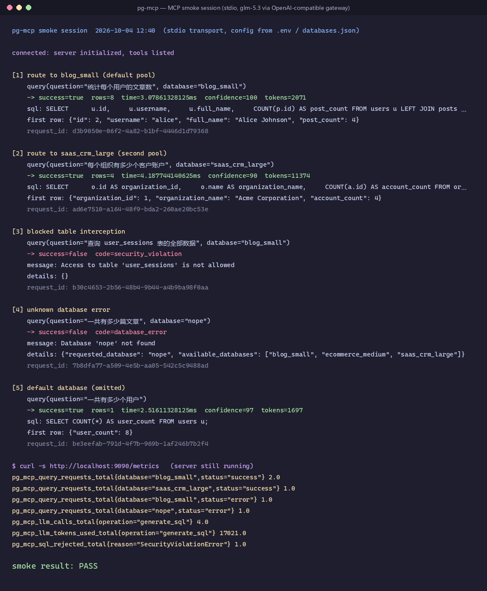
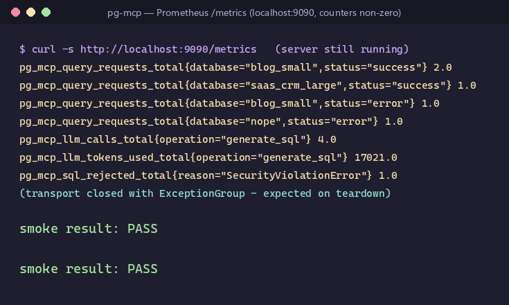

# pg-mcp 功能增强实施报告

## 1. 文档信息

| 项目 | 内容 |
| --- | --- |
| 文档编号 | specs/w6/0002-implementation-report.md |
| 版本 | 1.0 |
| 日期 | 2026-10-04 |
| 状态 | 实施完成，全部验证通过 |
| 关联文档 | `specs/w6/0001-enhancement-design.md`（设计方案）、`docs/DEVELOPMENT.md`（开发指引）、`README.md` / `CLAUDE.md`（使用与开发文档） |
| 验证环境 | WSL2 Ubuntu 24.04 · Python 3.14 · PostgreSQL 16（用户级集群，端口 5433） · LLM 经 OpenAI 兼容网关（智谱 BigModel，`glm-5.3`） |

---

## 2. 摘要

本期增强针对 pg-mcp（PostgreSQL 自然语言查询 MCP 服务器）评审中发现的三项核心缺陷——**多数据库与安全控制未启用**、**弹性与可观测性停留在设计层面**、**响应模型缺陷与测试覆盖不足**——完成了从方案设计（`specs/w6/0001`）到落地实现的全部工作，并在真实环境冒烟中驱动出三项补充修复。

**核心成效**：

| 维度 | 增强前 | 增强后 |
| --- | --- | --- |
| 多数据库 | 仅单库；`request.database` 在执行步被丢弃 | 一份 `databases.json` 配置多库，按库名路由到独立连接池与安全策略；缺省库/唯一库自动选择 |
| 安全控制 | 表/列黑名单与 EXPLAIN 开关硬编码关闭；`EXPLAIN ANALYZE` 可绕过全部校验 | 每库 `blocked_tables` / `blocked_columns` / `allow_explain`，全局默认+每库覆盖；ANALYZE 变体默认拒绝，内层语句完整递归校验；列掩码防别名/裸列/`SELECT *` 绕过 |
| 弹性 | 限流器零调用；重试无退避；瞬时故障不重试 | 双信号量并发限制（超时返回 `rate_limit_exceeded`）；LLM 与数据库瞬时故障指数退避重试；LLM 熔断器 |
| 可观测性 | 指标全零；无请求贯穿标识 | 9 项 Prometheus 指标全链路埋点；`request_id` 贯穿日志与响应；token 用量如实记账 |
| 测试 | 覆盖率门禁从未触发；无安全测试套件；集成测试无环境守卫 | 四层测试体系（单元/安全/集成/端到端）共 **412 个用例全部通过**，覆盖率门禁生效（**83.12%** ≥ 80%） |
| 真实验证 | 无 | 真实 LLM 全链路（自然语言 → SQL 生成 → 安全校验 → 执行 → 结果验证）与 MCP 冒烟 5/5 通过，`/metrics` 计数非零 |

**质量门禁**：`pytest` 全绿 · 覆盖率 83.12%（门禁 80%）· `mypy --strict` 31 个源文件零问题 · `ruff` 全部通过。

---

## 3. 背景与问题

增强前基线（`main` @ `38843c3`）经 6 个并行探索代理差距分析与人工逐行验证，确认三项评审抱怨全部属实，并发现额外缺陷。问题按严重度归并为三大域（完整证据与 `file:line` 引用见设计方案第 2 章）：

### 3.1 问题域 A：多数据库与安全控制未启用（Critical）

- **A1 多库路由断裂**：配置层仅单库 `DatabaseConfig`；lifespan 只建 1 个连接池；`create_pools` 零调用者；orchestrator 恒用主库执行器——`request.database` 解析后在执行步被丢弃，多 pool 场景必然发生错误数据库执行。
- **A2 安全策略无法启用**：`SQLValidator` 的 `blocked_tables` / `blocked_columns` / `allow_explain` 能力已实现，但组装处硬编码 `None/None/False`，且 `SecurityConfig` 无对应字段——用户无论如何配置，黑名单永远为空。
- **A3 EXPLAIN ANALYZE 绕过校验**：`allow_explain=True` 时直接放行不校验内层语句，而 ANALYZE 会真实执行内层语句——一条 `EXPLAIN ANALYZE DELETE FROM users` 即可绕过全部黑名单造成数据破坏。
- **A4 `.env` 对嵌套配置节失效**：仅顶层 `Settings` 声明 `env_file`，8 个嵌套节均不继承——`.env` 中 `DATABASE_*` 等变量被静默忽略；叠加示例值 `OPENAI_MAX_TOKENS=32000` 违反 `le=4096` 约束，修好加载后按示例配置启动即崩。

### 3.2 问题域 B：弹性与可观测性未接线（High）

- **B1 限流器零调用**：`MultiRateLimiter` 创建后 `query` 工具从不 acquire（且其为信号量并发限制器而非 QPS 限流器，文档需如实说明）。
- **B2 重试无退避、瞬时错误不重试**：重试循环零等待；LLM 超时/限流直接抛出；`retry_delay` / `backoff_factor` 为死配置。
- **B3 指标全零**：`MetricsCollector` 与 HTTP 端点已建，但请求链路零调用；README 指标名与代码不符。
- **B4 追踪缺失**：`tracing` 模块零导入，orchestrator 手搓 `uuid4`，日志无法按请求聚合。

### 3.3 问题域 C：响应模型缺陷与测试不足（High/Medium）

- **C1 响应模型缺陷**：`QueryResponse` 两个同名 `to_dict` 互相覆盖；两个同名 `ErrorDetail` 类；`tokens_used` 恒为 0（`response.usage` 未读）；结果置信度硬编码伪造。
- **C2 错误码不一致**：server 层手搓大写字符串码（`SERVER_NOT_INITIALIZED` 等）不在 `ErrorCode` 枚举中。
- **C3 测试不可验证**：`fail_under=80` 但 addopts 无 `--cov`，门禁永不触发；`tests/security/` 不存在；server/observability/pool 零直接测试；集成测试无环境守卫（无库/无 key 时直接失败）。
- **C4 资源与文档**：行限制先全量 fetch 再切片；死配置字段（`allow_write_operations` 等）；CLAUDE.md/README 与实现大面积漂移（pglast vs sqlglot、目录结构、命令）。

---

## 4. 方案概述

### 4.1 关键决策

| 决策点 | 选择 | 理由 |
| --- | --- | --- |
| 多库配置载体 | JSON 文件（`DATABASES_FILE` → `databases.json`），未设置时回退单库 `DATABASE_*` | 结构化、可版本管理示例文件、对旧部署零破坏 |
| 安全粒度 | 每库 `blocked_tables` / `blocked_columns` / `allow_explain`，未设（null）继承 `SECURITY_*` 全局默认 | 全局兜底 + 按库覆盖，配置成本与灵活性兼顾 |
| 可观测性 | 接线现有 Prometheus/structlog 模块，不引入 OpenTelemetry | 以最小依赖补齐"看得见"，OTel 列入后续演进 |
| LLM 端点 | 支持 `OPENAI_BASE_URL` 接入任何 OpenAI 兼容网关 | 不绑定单一供应商；官方端点仍强制 `sk-` 密钥格式校验 |
| 驱动方式 | 分 9 个阶段实施（Phase 0-8），每阶段以 `pytest` 门禁收尾 | 缺陷修复原子落地，避免长期红窗 |

### 4.2 架构

```text
┌─────────────────────────────────────────────────────────────┐
│                      MCP Server (FastMCP)                   │
│        lifespan: 逐库装配 pool / validator / executor       │
└─────────────────────────────────────────────────────────────┘
                              │
                              ▼
┌─────────────────────────────────────────────────────────────┐
│                    Query Orchestrator                       │
│  - 按库名路由（sql_validators / sql_executors 字典）         │
│  - 退避重试（LLM 瞬时故障 + 数据库瞬时 sqlstate）            │
│  - 安全违规快速失败（不重试，不记熔断）                       │
│  - 指标埋点 / request_id 贯穿 / token 记账                   │
└─────────────────────────────────────────────────────────────┘
           │                  │                  │
           ▼                  ▼                  ▼
    ┌───────────┐     ┌────────────┐     ┌──────────────────┐
    │   SQL     │     │    SQL     │     │     SQL          │
    │ Generator │────▶│ Validator  │────▶│  Executor        │
    │ (LLM)     │     │ (每库策略)  │     │ (每库连接池)      │
    └───────────┘     └────────────┘     └──────────────────┘
           │                                      │
           ▼                                      ▼
    ┌───────────┐                          ┌──────────────┐
    │  Schema   │                          │   Result     │
    │  Cache    │                          │  Validator   │
    │ (每库)    │                          │  (LLM, 可关) │
    └───────────┘                          └──────────────┘
```

---

## 5. 实施内容

### 5.1 多数据库路由（问题 A1）

- 新增 `src/pg_mcp/config/databases.py`：`DatabaseEntry`（连接/池/安全三段配置，含 `to_database_config()` 复用建池逻辑）、`DatabasesFile`（逻辑名唯一性与 `default_database` 必须存在校验）、`load_databases_file()`（加载失败 fail-fast 并带文件上下文）、`resolve_database_entries()`（JSON 优先，否则回退 env 单条目）。
- `server.py` lifespan 按 registry 逐库创建独立 pool / validator / executor，以逻辑名为 key 注入 orchestrator 的 `sql_validators` / `sql_executors` 字典。
- 请求解析顺序：显式 `database` 参数 → `default_database` → 唯一库自动选择；未知名/歧义返回 `database_error`，`details.available_databases` 列出全部可用逻辑名。

### 5.2 每库安全策略（问题 A2 / A3）

- `SecurityConfig` 新增 `blocked_tables` / `blocked_columns` / `allow_explain`（逗号分隔解析，`NoDecode` 保持原始字符串），`databases.json` 每库 `security.*` 未设时继承全局默认。
- **EXPLAIN 修复**：`ANALYZE` 变体默认拒绝（会真实执行内层语句）；即使 `allow_explain` 开启，内层语句仍完整递归走表/列/函数黑名单校验。
- **列掩码防绕过**（集成测试驱动发现并修复）：`blocked_columns` 拦截裸列名（`SELECT email FROM users`）、表别名（`SELECT u.email ... users u`）、`SELECT *` 与 `table.*` 投影（引用表存在任何被掩码列即拒绝，fail-closed）；`COUNT(*)` 等函数内 star 不受影响。
- 执行层纵深防御保留：只读事务、`statement_timeout`、安全 `search_path`、可选 `SET ROLE` 只读角色。

### 5.3 弹性机制接线（问题 B1 / B2）

- `query` 工具包裹并发限制器：查询与 LLM 调用各自独立信号量（`RESILIENCE_QUERY_CONCURRENCY` / `RESILIENCE_LLM_CONCURRENCY`），等待超过 `RESILIENCE_RATE_LIMIT_TIMEOUT` 返回 `rate_limit_exceeded` 信封。
- LLM 瞬时故障（超时/上游不可用）与数据库瞬时 sqlstate（`08000`/`08003`/`08006`/`53300`/`40001`/`40P01` 等）指数退避重试（`retry_delay × backoff^attempt`，上限 30s）；永久错误快速失败。
- 校验失败带错误反馈重试（供 LLM 修正 SQL）；**安全违规除外**——见 5.7。

### 5.4 可观测性接线（问题 B3 / B4）

- 9 项 Prometheus 指标全链路埋点：`pg_mcp_query_requests_total{status,database}`、`pg_mcp_query_duration_seconds`、`pg_mcp_llm_calls_total{operation}`、`pg_mcp_llm_latency_seconds`、`pg_mcp_llm_tokens_used_total{operation}`、`pg_mcp_sql_rejected_total{reason}`、`pg_mcp_db_connections_active{database}`、`pg_mcp_db_query_duration_seconds`、`pg_mcp_schema_cache_age_seconds{database}`。
- `request_id`（contextvars）贯穿"生成 → 校验 → 执行 → 响应"全部日志，并作为字段返回在响应信封中，可用于事后检索同一请求的全部事件。
- `tokens_used` 如实记账（读取 `response.usage.total_tokens`），失败尝试的消耗也计入响应。
- 结构化日志（JSON/text 可选）带敏感信息过滤（DSN 脱敏）。

### 5.5 模型与配置清理（问题 A4 / C1 / C2 / C4）

- 修复 `.env` 加载：8 个嵌套配置节全部补 `env_file=".env"`；文档明确优先级 **OS 环境变量 > `.env` > 代码默认值**；`.env.example` 违规值（`OPENAI_MAX_TOKENS=32000`）修正为合法默认。
- 响应模型：单一 `to_dict`（`model_dump(exclude_none=True)`，保持紧凑信封形状）；`ErrorDetail` 统一为 pydantic 类并从 `errors.py` 唯一导出；`ErrorCode` 枚举值统一为小写字符串并与 server 层用法对齐（移除手搓大写码）；删除伪造的硬编码置信度。
- 死代码/死配置清理：`allow_write_operations`、`max_question_length`、`min_confidence_score`、`is_production/is_development`、server 级死全局 `_circuit_breaker`；`cache.max_size` 接线为真实 LRU 逐出；根目录 `main.py` 由无关桩文件恢复为真入口 shim。
- 执行安全增强：行限制由"全量 fetch 后切片"改为 SQL 下推包裹（`LIMIT max_rows + 1`，截断可检测）。

### 5.6 测试体系建设（问题 C3）

四层测试体系共 **412 个用例**：

| 层 | 规模 | 外部依赖 | 守卫机制 |
| --- | --- | --- | --- |
| 单元（`tests/unit/`） | 356 | 无 | 全部离线（mock 协作者） |
| 安全矩阵（`tests/security/`） | 32 | 无 | 双库矩阵、注入载荷、EXPLAIN 绕过、列掩码绕过变体 |
| 集成（`tests/integration/`） | 16 | PostgreSQL + fixtures 三库；多库路由用例以 stub 替代 LLM（无需 key） | `PG*` 环境变量守卫，库不可达自动 skip |
| 端到端（`tests/e2e/`） | 8 | 同上 + 有效 LLM 配置 | LLM 守卫（key 缺失自动 skip） |

- 覆盖率门禁实际生效：pyproject `addopts` 挂接 `--cov=pg_mcp --cov-fail-under=80`，当前 **83.12%**。
- 新增直接测试覆盖此前零测试模块：server lifespan 装配、query 工具信封、连接池、可观测性、多库配置加载。
- 集成守卫模式：环境不可达 → `pytest.skip` 而非失败，保证离线开发与 CI 可复现。

### 5.7 实测驱动的补充增强（真实环境冒烟发现）

以下三项在 Phase 8 真实 LLM 冒烟中暴露，随本期一并修复并附回归测试：

1. **`OPENAI_BASE_URL` 支持（OpenAI 兼容网关）**：`OpenAIConfig` 新增 `base_url` 字段并传入两处 `AsyncOpenAI` 客户端；设置网关后 API key 不再强制 `sk-` 前缀（适配网关自有密钥格式），官方端点仍维持原校验。本次验收即经智谱 BigModel 网关（`glm-5.3`）完成全部真实 LLM 验证。
2. **安全违规快速失败**：冒烟发现"校验失败带反馈重试"会把安全策略文本回喂 LLM，模型可生成一条不引用违禁表、但语义上"复述拒绝理由"的解释性 SELECT 通过校验，使最终信封 `success=true`（敏感数据未泄露，但语义误导）。修复：`SecurityViolationError` 立即失败返回，不重试、不计入 LLM 熔断器；`SQLParseError` 保留反馈重试。附回归单测（生成器仅调用 1 次、熔断计数为 0）。
3. **单元测试对本地 `.env` 免疫（hermetic）**：配置类按 cwd 解析 `.env`，开发者本地配置（`OPENAI_MODEL`、`DATABASES_FILE` 等）会渗入默认值断言。修复：autouse fixture 将每个测试切换到空临时目录；集成守卫改为从 OS 环境变量或仓库根 `.env` 收集 LLM 配置并显式注入，两类测试互不干扰。

---

## 6. 验证与测试结果

### 6.1 测试与静态检查

| 项目 | 结果 |
| --- | --- |
| 单元 + 安全测试（离线） | **388 passed**（`uv run pytest tests/unit tests/security`） |
| 集成 + 端到端（真实数据库与真实 LLM） | **24 passed**（`pytest -m integration`；含真实 LLM 全链路 6 例、MCP 工具契约 8 例、多库路由 10 例） |
| 总用例 | **412 passed，0 failed，0 skipped**（本验证环境守卫全部满足） |
| 覆盖率 | **83.12%**（门禁 ≥ 80%，`branch = true`） |
| 类型检查 | `mypy --strict` 31 个源文件**零问题** |
| Lint | `ruff check .` **全部通过** |

### 6.2 真实环境冒烟（MCP stdio 会话）

通过脚本化 MCP 客户端（`scripts/mcp_smoke.py`，stdio 传输，与 MCP Inspector / Claude Desktop 同路径）驱动服务，冒烟清单 **5/5 PASS**：

| 用例 | 预期 | 实际 |
| --- | --- | --- |
| 自然语言查询 → blog_small | 正确路由，返回结果信封 | `success=true`，8 行，含 `request_id` / `tokens_used` / 生成的 SQL |
| 自然语言查询 → saas_crm_large | 路由到第二个连接池 | `success=true`，4 行（organizations × accounts 聚合） |
| 查询被禁表 user_sessions（blog_small） | `security_violation`，查询不触达数据库 | `security_violation`：`Access to table 'user_sessions' is not allowed` |
| 指定未知名 nope | `database_error` + 可用库列表 | `available_databases=[blog_small, ecommerce_medium, saas_crm_large]` |
| 省略 database | 使用 default_database（blog_small） | `success=true`（`SELECT COUNT(*) FROM users` → 8） |

### 6.3 指标验证

冒烟会话期间抓取 `http://localhost:9090/metrics`，关键计数器全部非零且带多库标签（见第 7 章图 2）：

```text
pg_mcp_query_requests_total{database="blog_small",status="success"}   2.0
pg_mcp_query_requests_total{database="saas_crm_large",status="success"} 1.0
pg_mcp_query_requests_total{database="blog_small",status="error"}     1.0
pg_mcp_query_requests_total{database="nope",status="error"}           1.0
pg_mcp_llm_calls_total{operation="generate_sql"}                      4.0
pg_mcp_llm_tokens_used_total{operation="generate_sql"}                17021.0
pg_mcp_sql_rejected_total{reason="SecurityViolationError"}            1.0
```

---

## 7. 效果展示

### 7.1 多数据库路由与安全拦截（真实 MCP 会话）

下图为真实冒烟会话记录（stdio 传输，LLM 为经 OpenAI 兼容网关接入的 `glm-5.3`）：前两例展示同一次会话内按 `database` 参数路由到两个不同连接池并返回正确聚合结果；第三例展示 `blocked_tables` 策略在 SQL 校验层拦截违禁表查询（`security_violation`，查询未触达数据库）；第四例展示未知库名的错误信封（附可用数据库列表）；第五例展示省略 `database` 时回落默认库。每个响应均携带贯穿全链路的 `request_id` 与如实的 `tokens_used`。



### 7.2 Prometheus 指标（非零验证）

下图为冒烟会话进行期间抓取的 `/metrics` 输出：请求计数按 `database` 标签区分多库流量（成功/错误分列）；LLM 调用与 token 消耗被如实计量；安全拦截计入 `pg_mcp_sql_rejected_total{reason="SecurityViolationError"}`。增强前这些计数器恒为零。



---

## 8. 变更规模

| 类别 | 数量 | 说明 |
| --- | --- | --- |
| 修改文件 | 33 | +3,021 / −3,491 行（含 uv.lock 依赖收敛） |
| 新增源码模块 | 1 | `src/pg_mcp/config/databases.py`（多库配置加载与校验） |
| 新增测试文件 | 8 | 多库配置、信封、可观测性、lifespan、工具、连接池、多库路由集成、安全矩阵 |
| 新增脚本 | 1 | `scripts/mcp_smoke.py`（可复用的脚本化 MCP 冒烟） |
| 文档 | 5 | 本报告、设计方案、开发指引（`docs/DEVELOPMENT.md`）、`CLAUDE.md`、`README.md` 全部对齐真实实现 |

---

## 9. 风险与后续工作

### 9.1 已知风险与缓解

| 风险 | 缓解措施 |
| --- | --- |
| `databases.json` 含数据库密码 | 已加入 `.gitignore`（仅提交 example）；生产建议改用秘密管理系统注入 |
| 开发用 PostgreSQL 集群采用 trust 认证 | 仅监听 localhost、仅限本地开发；生产部署指南给出 scram + 只读角色方案（README 安全章节） |
| 推理型网关模型 token 消耗较高（本次 `glm-5.3` 单次 2k-11k tokens） | 可按需切换轻量模型（如 `glm-4-flash`/`gpt-4o-mini`）；`VALIDATION_ENABLED=false` 可再省一次 LLM 调用 |
| LLM 结果验证默认开启，延迟与成本加倍 | 配置项可关；关闭后仍保留 SQL 校验层全部安全检查 |

### 9.2 后续工作建议

1. **Schema 懒加载与连接池预热**：多库启动成本随库数线性增长，非默认库可延迟至首次请求。
2. **OpenTelemetry 分布式追踪**：在现有 `request_id` 贯穿基础上接入标准追踪体系，支撑跨服务调用链分析。
3. **每库速率策略**：当前并发限制全局生效，可按库配置差异化限额。
4. **网关模型路由**：按问题复杂度分级路由模型（简单计数类问题走轻量模型），平衡成本与质量。

---

## 附录：验证命令清单

```bash
# 离线测试（含覆盖率门禁）
uv run pytest

# 集成/端到端（fixtures 三库 + LLM 配置；守卫不满足时自动 skip）
PGHOST=localhost PGPORT=5433 PGUSER=$USER PGPASSWORD=any \
  uv run pytest -m integration --no-cov

# 静态检查
uv run mypy src && uv run ruff check .

# 脚本化 MCP 冒烟（stdio，含 /metrics 抓取）
uv run python scripts/mcp_smoke.py
```
